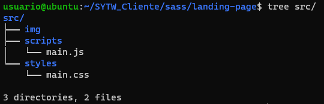

# Práctica 1: SASS

### Ejercicios introductorios

Los ejercicios resueltos se encuentran en el directorio [ejercicios](ejercicios). [Enunciado](https://github.com/isanchezberriel/TWFE-1020/blob/master/Sass.md)

* [Ejercicio 2](ejercicios/ej2.scss)
* [Ejercicio 3](ejercicios/ej3.scss)
* [Ejercicio 4](ejercicios/ej4.scss)
* [Ejercicio 5](ejercicios/ej5.scss)
* [Ejercicio 6](ejercicios/ej6.scss)
* [Ejercicio 7](ejercicios/ej7.scss)


### Herramientas

Para realizar el ejercicio [Sass](https://github.com/isanchezberriel/TWFE-1020/blob/master/Ejercicio_Sass_21_22.md) de la práctica antes fue necesario preparar la máquina virtual y el directorio del proyecto. Los pasos fueron los siguientes:

1. Se instalaron las herramientas necesarias: nodejs, npm, git, yeoman, generator-learnfe, git, gulp, sass
2. Se creó la estructura del proyecto

```bash
mkdir landing-page
cd landing-page
npm init
npm i yo
npm i generator-learnfe
yo learnfe
```

Esto crea la estructura de directorios:



3. La siguiente etapa es utilizar un automatizador de tareas, en este caso Gulp. Que se encarga de las siguientes tareas:

  * Actualizaciones en tiempo real en el navegador


  * Minificar el CSS


  * Sourcesmaps


### Landing Page

